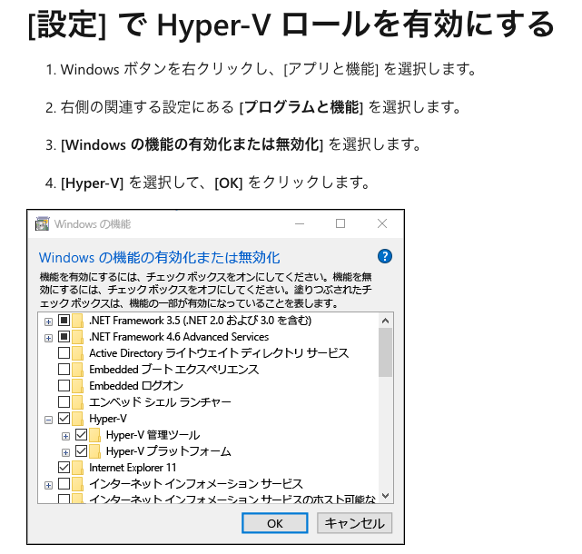

# Laravel Docker Windows10 開発環境

このリポジトリはWindows 10上でDocker を使用してLaravel開発環境を構築するための手順とファイルを含んでいます。

## 前提条件


以下の要素が必要です。各項目がなぜ必要かも説明します：

1. Windows 10 64ビット (Home または Pro 22H2 (build 19045) 以上推奨)
   - Docker Desktopは64ビットOSを必要とし、最新の機能と安定性を確保するため新しいビルドを推奨しています。

2. WSL 2の有効化
   - WSL 2は、Windows上でLinuxカーネルを実行するための基盤です。Docker DesktopはWSL 2を利用してLinuxコンテナを効率的に実行します。

3. Hyper-V の有効化
   - Hyper-Vは、Windows上で仮想マシンを実行するためのMicrosoftの仮想化技術です。Docker DesktopはHyper-Vを使用して、コンテナの分離と管理を行います。

4. Linux カーネル更新プログラムのインストール
   - WSL 2で最新のLinuxカーネル機能を利用するために必要です。これにより、DockerコンテナとWSL 2の互換性と性能が向上します。

5. Ubuntu のインストール
   - UbuntuはWSL 2上で動作するLinuxディストリビューションです。Docker Desktop for WindowsはUbuntuなどのWSLディストリビューションを利用して、Linuxベースのコンテナを効率的に実行します。

6. Docker Desktopのインストール
   - Docker Desktopは、Windowsでのコンテナ開発と実行を容易にするツールです。LaravelアプリケーションをDockerコンテナ内で開発・実行するために必要です。

これらの要素を準備することで、Windows上でLinuxコンテナを効率的に実行し、Laravelの開発環境を整えることができます。



## セットアップ手順

### 1. システム要件の確認

- [Docker Desktop for Windows のシステム要件](https://docs.docker.jp/desktop/install/windows-install.html)を確認してください。
- Windows 10 Home または Pro 21H2 (build 19044) 以上が必要です。

### 2. WSL 2の有効化

- Windows の「機能の有効化または無効化」から WSL を有効にします。
- 詳細な手順は [Microsoft の公式ドキュメント](https://docs.microsoft.com/ja-jp/windows/wsl/install-manual) を参照してください。

### 3. Docker Desktop のインストール

1. [Docker Desktop for Windows](https://docs.docker.com/desktop/install/windows-install/) からインストーラーをダウンロードします。
2. `Docker Desktop Installer.exe` をダブルクリックしてインストールを開始します。
3. インストール完了後、Windows を再起動します。

### 4. Hyper-V の有効化

1. 「コントロールパネル」>「プログラム」>「Windows の機能の有効化または無効化」を開きます。
2. 「Hyper-V」にチェックを入れ、OKをクリックします。
3. Windows を再起動します。

### 5. Linux カーネル更新プログラムのインストール

1. [x64 マシン用 WSL2 Linux カーネル更新プログラム パッケージ](https://wslstorestorage.blob.core.windows.net/wslblob/wsl_update_x64.msi) をダウンロードします。
2. ダウンロードしたMSIファイルを実行してインストールします。

### 6. Ubuntu のインストール

1. Microsoft Store を開き、"Ubuntu" を検索します（例: Ubuntu 20.04.3）。
2. Ubuntu をインストールし、起動します。
3. ユーザー名とパスワードを設定します（例: user:test, pass:test）。

### 7. Docker Desktop の設定

1. Docker Desktop を起動します。
2. Settings（歯車アイコン）> Resources > WSL Integration を開きます。
3. 使用する Ubuntu ディストリビューションを有効にします。
4. Apply & Restart をクリックします。


### 8. Laravel プロジェクトの作成

1. Ubuntu ターミナルを開きます。
2. 以下のコマンドを実行して Laravel プロジェクトを作成します：

```bash
curl -s "https://laravel.build/example-app" | bash
```